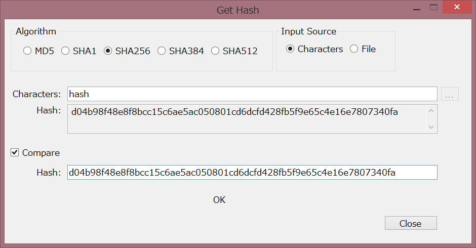

# GetHash
Windows Form application to get and compare hash which is MD5, SHA1, SHA256, SHA384 and SHA512.

## Environment
- .NET Core 3.1
- Windows 8.1 or later.

## License
MIT

## Download
[Download](https://github.com/yukgithub/GetHash/wiki/Download-Page) page is here.

## Features
- This tool can create hash which kind is MD5, SHA1, SHA256, SHA384 and SHA512.
- Enable Input sources are plain text and files.
- This tool can validate hashes.
- Drag and drop to the input source file.
- If you set a file path as a first argument, this tool sets the file path automatically.

## Basic Usage
1. just execute GetHash.exe file.
2. Drag and drop a file to GetHash.exe file.

********************

## 実行可能環境
- .NET Core 3.1
- Windows 8.1、もしくはそれ以降。

## ライセンス
MIT

## ダウンロード
[ダウンロード](https://github.com/yukgithub/GetHash/wiki/Download-Page) はこちらから。

## 主な機能
- MD5, SHA1, SHA256, SHA384, SHA512のハッシュ値を出力。
- 入力ソースには文字列とファイルの両方を指定可能
- ハッシュ値の検証が可能（2つハッシュ値を比較する）
- 入力ソースはドラッグアンドドロップが可能
- 引数のファイルパスを指定して起動すると、自動でファイルのハッシュ値を出力した状態で起動する

## 使い方
- GetHash.exeを起動する
- GetHash.exeにファイルをドラッグアンドドロップする（後は画面を見れば分かると思います…）
